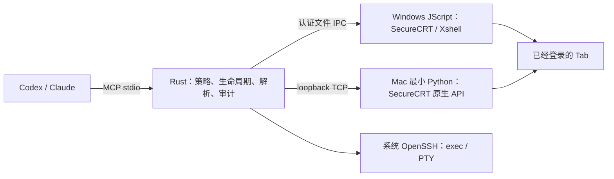

# securecrt-mcp

[](https://github.com/seaworld008/securecrt-mcp/actions/workflows/ci.yml)
[](https://github.com/seaworld008/securecrt-mcp/releases)
[English](README.en.md) · [安装](docs/installation.md) · [真机验收](docs/desktop-acceptance.md) · [接口](docs/connectors.md)

**securecrt-mcp 0.5.2** 是 Rust MCP Server，让 Codex、Claude 等客户端复用 SecureCRT / Xshell 中已经登录的 SSH Tab。统一 `connector_*` 接口负责目标句柄、批量执行、退出码、分页、超时和审计；模型客户端负责审批，远端账号决定权限。

桌面后端复用现有 VPN、堡垒机、密钥和 MFA，不导出凭据、不另建 SSH 连接。显式选择的 `openssh` 后端另行使用系统 OpenSSH、现有 Agent、`ssh_config` 和 known_hosts，支持持久 exec / PTY。

## 一键安装

使用包含当前源码的 CI 测试包或对应发布包。**main 更新不会覆盖已发布的旧资产**；请核对 ZIP 中包含 `install.command` / `install.cmd` 和当前平台入口。下载时对照 `SHA256SUMS` 校验。

| 平台 | 解压后安装 | 在终端内运行的固定入口 | 用户运行依赖 |
| --- | --- | --- | --- |
| Windows SecureCRT | 双击 `install.cmd` | `%USERPROFILE%\.securecrt-mcp\securecrt-mcp-securecrt.js` | 系统 JScript；无需 Python、Node、Rust |
| Windows Xshell | 双击 `install.cmd` | Xshell 标准 `Scripts` 目录中的 `securecrt-mcp-xshell.js` | 系统 JScript；无需 Python、Node、Rust |
| macOS SecureCRT | 双击 `install.command` | `~/.securecrt-mcp/securecrt_bridge.py` | SecureCRT 可加载的 Python 引擎；桥接仅用标准库 |

也可执行 `securecrt-mcp install`。安装把二进制放在用户私有目录，部署当前平台入口，并增量更新 Codex 的 `mcp_servers.securecrt` 二进制路径及所选应用目录环境。保留其他模型、插件、MCP、现有审批及工具设置；保留 Bridge Token、策略、自定义拒绝规则和 SSH 登录。不修改全局 PATH。

安装后重新加载 Codex，并在已登录终端空闲时通过 **Script → Run** 选择固定入口。SecureCRT 每个进程运行一次，覆盖该进程所有已连接 Tab；其他 Tab 重复运行会友好提示。停止时回到最初启动脚本的 Tab，选择 **Script → Cancel**。Xshell 按实际发现的窗口/Tab 范围运行。

Windows 也可直接选择解压包内的自包含 `.js` 文件，自动释放配套 Rust 程序。Mac 的 JScript 原生接口不受厂商支持，因此只保留一个最小 Python 原生适配文件；构建、打包、客户端和验收控制器均已迁移到 JS/Rust。桥接不额外限制已成功加载 Python 的最高版本，依据实际 API 和脚本摘要检查；SecureCRT 自身的引擎加载范围仍有效。[厂商平台说明](https://www.vandyke.com/products/securecrt/scripts.html)

Mac 优先复用已经可用的引擎，无需 `pip`、pywin32 或手动挑选 PATH。缺少引擎时以当前 SecureCRT 的加载错误和系统要求为准，安装其支持的官方运行时后重启应用；不能把“任意 Python 都可用”当作承诺。[官方加载说明](https://www.vandyke.com/support/tips/how-to-use-python-scripting-securecrt-on-macos.html)

## 升级和诊断

新包再次执行 `install`，更新私有二进制及固定入口；源码开发者执行：

```sh
git pull --ff-only origin main
cargo build --release --locked
./target/release/securecrt-mcp install
```

只更新已配置入口时可用 `upgrade`。普通更新不要使用 `init --force`。磁盘上的脚本变化不会替换已加载实例：空闲时取消旧脚本，再运行同一路径，重启 MCP 后重新发现目标，旧句柄作废。

```sh
securecrt-mcp doctor --offline
securecrt-mcp doctor --backend securecrt
securecrt-mcp doctor --backend xshell
securecrt-mcp doctor --backend openssh
```

使用安装输出的二进制绝对路径；安装不添加 PATH。`--offline` 检查本地配置，在线 `doctor` 核对真实引擎、终端版本、API 和运行脚本摘要。Windows 方法接口在实际发送/捕获成功后才记录为已验证；未知能力不冒称通过。`doctor` 成功与编译成功都不能代替真机验收。

## 日常使用

1. `connector_list` 发现会话，核对后端、标题与当前屏幕。
2. `connector_open` 显式绑定目标，保留返回的 `session_id`。
3. 同一附件连续 `connector_exec`，或提交最多 20 条明确命令的 `connector_exec_batch`。
4. 检查每条的 `state`、`sent`、`exit_code`、`error_code`，用 cursor 分页读取输出。
5. 超时或未知结果停止新输入，先检查原 Tab；仅在原命令结束和空闲边界确认后，用新鲜屏幕令牌显式恢复。本工具不自动重试、Ctrl+C 或确认空闲。

不同 Tab 分别持有捕获与未决状态；同一 operation ID 在同一 MCP 进程返回原命令结果，不能推广为跨进程永久去重。批量每条拥有独立退出码与回执，不确定结果停止后续命令。OpenSSH 的 `connector_stream_*` 支持长驻流、分页器、REPL、resize 和原始 PTY 输入；桌面屏幕后端没有原生 PTY。



频繁从 CLI / JS / PowerShell 调用时，可显式启用可选 loopback daemon，共享同一个 Engine。MCP 本身已经常驻，无需额外启动 daemon。详见[持久终端](docs/persistent-terminal.md)和[命令行客户端](docs/clients/command-line.md)。

## 验收与开发

真实桌面规范、D01–D14 与 U01–U04 用例见[验收规范](docs/desktop-acceptance.md)和[测试用例](docs/desktop-test-cases.md)。Windows 历史四 Tab 回执保留；Mac 用本机真实 SDK/SSH 单独验收，记录确切源码、二进制/桥接摘要和是否有未提交修改。失败回执保留，不能增加原定 10 秒长输出预算制造通过。

明确授权全部已连接空闲测试终端后：

```sh
node tests/desktop_matrix.js target/release/securecrt-mcp --backend securecrt --all-idle --expect-securecrt 2 --exercise-recovery --output-dir .local-evidence/mac-desktop-UNIQUE
```

有业务 Tab 时用多个 `--target securecrt=OPAQUE_ID` 限定。重复启动、取消/重载、断开/重连需要真实 UI 配合；未做的项目明确标未测。回执不提交主机地址、用户名、会话 ID、Token 或已有终端历史。

开发使用 Rust 1.88+、Node；仅 Mac 原生适配契约开发测试需要 Python，最终用户的 Windows 入口不依赖这些开发环境。

```sh
cargo fmt --all -- --check
cargo clippy --locked --all-targets --all-features -- -D warnings
cargo test --locked --all-targets --all-features
cargo build --locked
node tests/windows_bridge_test.js
node tests/mcp_smoke.js target/debug/securecrt-mcp
node tests/mac_adapter_contract.js
node scripts/validate_repository.js
```

完整 CI 和打包命令见[开发测试](docs/testing.md)。真实客户端审批拒绝路径仍需操作者在对应客户端验证，MCP annotations 不代替客户端审批。安装和更新不放宽任何已有审批规则。

[支持策略](docs/support-policy.md) · [支持矩阵](docs/support-matrix.md) · [安全模型](docs/security-model.md) · [故障排查](docs/troubleshooting.md) · [贡献](CONTRIBUTING.md) · [许可证](LICENSE)
