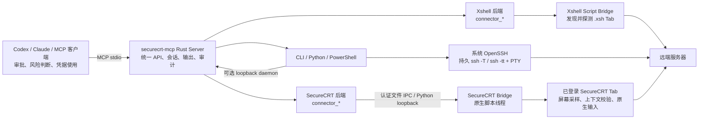

# securecrt-mcp

[](https://github.com/seaworld008/securecrt-mcp/actions/workflows/ci.yml)
[](https://github.com/seaworld008/securecrt-mcp/releases)
[](LICENSE)
[](https://www.rust-lang.org/)
[English](README.en.md)

**securecrt-mcp 0.5.2** 是一个面向生产环境的 Rust MCP Server：让 Codex、Claude 等 MCP 客户端通过统一的 `connector_*` 接口安全、可审计地操作 SecureCRT、Xshell 中已经登录的 SSH 会话，以及系统 OpenSSH/PTY 连接器。

它复用操作员已经完成的 VPN、堡垒机、SSH 密钥和 MFA 流程，不建立第二条 SSH 连接，也不导出服务器凭据。项目独立于 VanDyke Software。

> **生产定位**：适合运维诊断、发布检查、日志查看和受控变更。它是 SecureCRT 会话连接层，不是原生 SSH/PTY，也不是第二套 AI 权限系统。客户端审批、远端账号权限和人工目标确认仍然有效。

> **统一连接器**：所有后端都使用 `connector_*` 工具；调用 `connector_open` 时显式指定 `backend`。SecureCRT/Xshell 复用已有桌面登录，OpenSSH 使用现有 `ssh_config`、Agent、ProxyJump 和 known_hosts，不在 MCP 中保存密码。详见 [统一连接器](docs/connectors.md)。

## 能力概览

Windows 自带运行环境的 `.js` 入口、固定脚本更新步骤，以及 Windows / Mac
分别验收的标准见 [桌面测试与验收规范](docs/desktop-acceptance.md)。新入口只有
取得对应客户端真机回执才视为通过；macOS 继续使用原生 Python 桥接。

- 复用已登录的 SecureCRT Tab，按不透明会话句柄绑定目标，避免用 Tab 序号误操作。
- `attach -> exec` 连续执行，减少重复建立连接、读屏和令牌开销。
- `exec_batch` 支持最多 20 条命令，每条拥有独立输出、退出码、审计和 command ID；不确定结果始终停止。
- 批量读取原生缓冲、增量输出和滚动游标，长日志明确报告截断或 gap。
- per-session 捕获、lease、超时、interrupt、idle acknowledgement 和未决任务隔离。
- 可选 loopback daemon，供 CLI、Python 和 PowerShell 高频调用复用同一个 Engine。
- 默认仅做少量极高危防误操作过滤；普通命令由 MCP 客户端审批和远端账号权限决定。
- 不自动重放未知命令，不自动 Ctrl+C，不自动切换到同名会话，不静默绕过客户端审批。
- OpenSSH connector 使用持久 `ssh -T`/`ssh -tt` 会话，支持命令、长驻流、PTY 输入、resize 和绝对 cursor 分页。

## 架构与连接器



如果客户端不渲染 Mermaid，可按下面的两条路径理解：

```text
MCP 客户端（Codex / Claude）
        |
        v
Rust securecrt-mcp（统一会话、输出、状态和 no-replay 语义）
        +--> SecureCRT 后端 --> 文件 IPC / Python Bridge --> 已登录 SecureCRT Tab
        +--> Xshell 后端 --> 文件 IPC Bridge --> 已登录 Xshell Tab
        \--> OpenSSH 后端 --> 持久 ssh/PTY --> 远端服务器
```

| 后端 | 主要工具 | 连接方式 | 适用场景 |
| --- | --- | --- | --- |
| SecureCRT | `connector_*` | 复用 SecureCRT 已登录 Tab，经本机 Bridge 调用 | 复用现有 VPN、堡垒机、MFA 和桌面会话 |
| Xshell | `connector_*` | Xshell Script Bridge 发现并复用 `.xsh` 命名 Tab | 每个 Xshell 进程独立注册，MCP 自动汇总；不读取会话内容 |
| OpenSSH/PTY | `connector_*` | 系统 OpenSSH 的持久 `ssh -T` 或 `ssh -tt` 会话 | 高频命令、长驻流、REPL、分页和原始 PTY 交互 |

SecureCRT、Xshell 和 OpenSSH 都必须显式指定 `backend`，不会在后端之间自动切换。上层模型负责审批、危险判断和凭据使用；MCP 负责连接生命周期、输出流、退出状态、分页和未知结果不重放。

OpenSSH 示例：

```json
{
  "name": "connector_open",
  "arguments": {
    "backend": "openssh",
    "target": "php-test",
    "mode": "exec"
  }
}
```

返回的 `session_id` 可继续用于 `connector_exec`、`connector_exec_batch`、`connector_read` 或 PTY 流工具。SecureCRT/Xshell 的 screen-backed 会话还可使用 `connector_read_screen`、`connector_heartbeat` 和 `connector_acknowledge`。

## 已验证范围

0.5.2 的 Rust、Bridge、MCP stdio、批量执行、daemon、故障注入、打包和连接器自动化测试已通过。真实桌面验收需要在当前 SecureCRT/Xshell 进程重新加载对应脚本后完成：

- Linux SSH Tab：`hostname`、`uptime`、`pwd`、`id` 连续执行成功。
- 四命令 batch 完成，逐条返回输出和退出码。
- 慢重绘场景会等待有限预算；上下文仍不稳定时返回 `context_changed`，不发送下一条命令。
- 长输出可按游标分页读取，观察模式 attachment 会拒绝执行且 `sent=false`。
- 重复运行 Bridge 脚本时显示中文“已经在运行”提示，不再暴露 Python 端口异常。

测试成功不等于原生 SSH 等价。真实目标、客户端审批、SecureCRT/Xshell 桌面行为和远端业务仍应在你的环境完成验收；磁盘上的脚本更新不会替换客户端内存中的旧脚本。

## 安装（Windows）

### 1. 下载并校验

本次新增的 Windows 自包含 `.js` 入口需使用包含这次改动的源码构建包或 CI 测试包。现有 `v0.5.2` 正式 Release 是旧入口，不包含这些新增功能；合并 main 不会自动覆盖旧 Release 资产。

从 [最新 Release](https://github.com/seaworld008/securecrt-mcp/releases/latest) 下载 Windows x64 ZIP，同时下载 `SHA256SUMS`，在 PowerShell 中校验：

```powershell
Get-FileHash .\securecrt-mcp-0.5.2-x86_64-pc-windows-msvc.zip -Algorithm SHA256
Get-Content .\SHA256SUMS
```

Release 包含可执行文件、许可证、中文说明和对应版本的 SecureCRT Bridge。校验和用于发现传输损坏，不代替发布者身份验证。

### 2. 初始化 Bridge

解压后运行：

```powershell
.\securecrt-mcp.exe init
.\securecrt-mcp.exe paths
```

也可以直接从解压包选择下面的 `.js` 脚本，首次运行自动初始化，不必先执行 `init`：

| 客户端 | 运行脚本 | `init/upgrade` 更新的固定入口 |
| --- | --- | --- |
| SecureCRT | `securecrt-mcp-securecrt.js` | `%USERPROFILE%\.securecrt-mcp\securecrt-mcp-securecrt.js` |
| Xshell | `securecrt-mcp-xshell.js` | Xshell 标准 `Scripts` 目录中的同名文件 |

Windows 新入口自带配套程序，使用系统 JScript，不安装 Python、pywin32 或 Rust。
SecureCRT 在菜单 **Script -> Run** 选择脚本；每个应用进程运行一次即可管理该进程的
全部已连接 Tab，其他 Tab 再次运行会提示“已经启动，无需重复运行”。取消入口是
**Script -> Cancel**，需回到启动脚本的 Tab。Xshell 在 **Tools -> Script -> Run**
选择对应脚本，按实际可发现的窗口/会话范围启动，MCP 汇总在线实例。

成功提示显示实际已连接会话数并自动关闭，桥接继续运行；没有登录时会话列表为空，
之后可重新枚举发现连接。先完成实际执行，再检查接口记录：

```powershell
.\securecrt-mcp.exe doctor
.\securecrt-mcp.exe doctor --backend xshell
```

Windows COM 方法属性读取可能直接调用等待/发送方法。新入口的在线检查只读取安全
属性；发送、捕获方法在真实调用成功后才记为已验证，使用前为未知。

旧 Python 入口仍供已有配置和 macOS 使用，版本限制与厂商 Python 配置见
[支持策略](docs/support-policy.md)。Windows 新入口不会使用旧 Python 绑定。
原生诊断记录位于私有目录 `<backend>-native-ipc/instances/<实例>/diagnostic.json`，
只记录捕获生命周期和计数，不包含 Token、命令内容或终端历史。

### 3. 升级

普通升级不要使用 `init --force`：

```powershell
git pull --ff-only origin main
cargo build --locked --release
.\target\release\securecrt-mcp.exe upgrade
.\target\release\securecrt-mcp.exe doctor --offline
```

`upgrade` 保留现有 Token、策略和自定义拒绝规则，Windows 同名 `.js` 入口直接更新。
升级后闲时取消旧脚本，再选择原来的同名文件；替换磁盘文件不会更新已加载的脚本。
旧 Python 入口沿用现有升级行为，本轮不新增备份管理功能。

## MCP 客户端配置

生成 Codex 终端工具配置：

```powershell
.\securecrt-mcp.exe codex-config --toolset terminal --approval-mode prompt
```

将输出合并到现有 Codex 配置，不要覆盖其他 MCP。Claude Code 示例：

```powershell
claude mcp add --transport stdio --scope user securecrt -- `
  "C:\Tools\securecrt-mcp.exe" serve
```

客户端权限模式由操作者选择。生产环境建议先使用 `prompt` 完成拒绝路径验收，再按组织策略启用更宽松的客户端审批模式。

## 日常操作路径

1. `connector_list` 列出各后端会话，核对后端、标题、目标和当前屏幕。
2. 对确认无误的会话调用 `connector_open`，保存返回的 `session_id`。
3. 复用同一个 `session_id` 调用 `connector_exec`；多步诊断使用 `connector_exec_batch`。
4. 每次检查 `state`、`sent`、`exit_code`、`error_code`、输出游标和审计字段。
5. OpenSSH 长日志使用 `connector_stream_*`；需要停止远端前台程序时显式调用 `connector_interrupt`。

示例：

```json
{
  "attachment_id": "实际 attachment_id",
  "command": "hostname",
  "mode": "posix",
  "timeout_ms": 30000
}
```

```json
{
  "attachment_id": "实际 attachment_id",
  "commands": ["hostname", "uptime", "df -h"],
  "operation_id": "ops-check-20260922-001",
  "on_error": "stop"
}
```

Batch 不是事务，也不是永久授权；所有命令应在客户端第一次批准时明确列出。未知、超时、上下文变化和传输失败始终停止，不自动重放。

## 安全边界

- Windows 原生 Bridge 使用用户私有文件 IPC；Python SecureCRT Bridge 只监听 `127.0.0.1`。两者使用随机 Token、请求 deadline 和消息大小上限。
- `client` 模式把日常命令审批交给 Codex/Claude 等客户端；内置规则只拦截少量关键破坏性命令，不是 Shell 静态分析器或沙箱。
- `shared`、`exclusive`、`observe` 是连接器协作模式，不是 SecureCRT 键盘锁。人工输入、重连和嵌套 SSH 目标仍需操作员确认。
- attachment 不等于永久授权；daemon 重启后不提供 exactly-once 保证。
- POSIX 完成标记只证明前台命令返回，不证明后台子进程终止。
- MySQL、pager、REPL、编辑器、密码框等非普通 POSIX 提示符应先读屏确认，不要直接发送 Shell batch。

完整定义见 [安全模型](docs/security-model.md)、[持久终端指南](docs/persistent-terminal.md) 和 [生产验收清单](docs/production-readiness.md)。

## 生产验收清单

- [ ] 在目标 SecureCRT 版本运行 `doctor`，确认 Bridge 版本和 capabilities。
- [ ] 在测试 Tab 中拒绝一次无害命令，确认客户端拒绝后 SecureCRT 没有输入回显。
- [ ] 在同一 attachment 上完成连续命令和一个小 batch。
- [ ] 验证一个慢重绘 Tab 会等待或安全返回 `context_changed`，不会重复执行。
- [ ] 明确区分普通 shell、MySQL/REPL、pager 和编辑器上下文。
- [ ] 为 daemon、审计目录和 Token 备份设置本机访问控制和备份策略。
- [ ] 先在非生产 Tab 验证，再开放生产会话。

## 文档导航

- [中文生产验收](docs/production-readiness.md)
- [持久终端与批量操作](docs/persistent-terminal.md)
- [安全模型](docs/security-model.md)
- [架构与协议](docs/architecture.md) · [Bridge 协议](docs/bridge-protocol.md)
- [性能与已知限制](docs/performance.md)
- [统一连接器与 OpenSSH/PTY](docs/connectors.md)
- [连接器顶层架构与 Xshell](docs/connector-architecture.md)
- [排障](docs/troubleshooting.md)
- [Codex](docs/clients/codex.md) · [Claude](docs/clients/claude.md)
- [发布流程](docs/releases.md)

## 开发与验证

```powershell
cargo fmt --all -- --check
cargo clippy --locked --all-targets --all-features -- -D warnings
cargo test --locked --all-targets --all-features
python -m pytest -q tests
python scripts/validate_repository.py
```

贡献方式见 [CONTRIBUTING.md](CONTRIBUTING.md)，安全问题请按 [SECURITY.md](SECURITY.md) 私下报告。

## 许可证

MIT License，详见 [LICENSE](LICENSE)。
