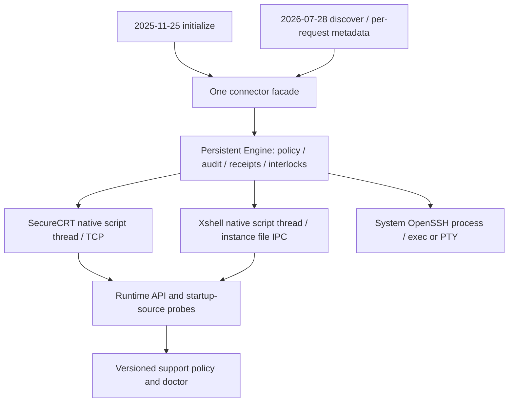

> 当前安装与平台入口见[一键安装](installation.md)。Windows 仅使用 `.js`；Mac 仅保留 `securecrt_bridge.py` 原生层，工具均为 JS/Rust。

# Connector architecture

## Compatibility and lifecycle contract

The native adapter is a narrow product API boundary. All SecureCRT/Xshell API
calls remain on the product script thread. Rust owns policy, operation receipts,
bounded output, per-session interlocks, batch state and auditing. Desktop adapters
reuse authenticated tabs; OpenSSH owns its subprocess/PTY. Backend choice is
explicit and failures never silently switch targets or products.



Modern MCP has no initialization session, but command lifetime and operation
deduplication still belong to the persistent Engine/daemon. Per-request client
metadata is display/protocol context, not authorization or a new native owner.
Unknown delivery, capture cancellation and timeout keep the send interlock;
only observed completion or explicit verified recovery releases it. Evicting
output never authorizes replay.

`doctor` distinguishes missing APIs from unobserved tab capabilities, compares
the running script's startup digest with the binary snapshot, and reports repair
steps without modifying policy. Product versions are a compatibility hint;
required capabilities and actual smoke receipts determine support status.
Optional metadata/notifications may degrade, while Get2/ReadString or native
message-pump requirements are never replaced with different semantics.
See [API inventory](api-compatibility.md), [matrix](support-matrix.md), and
[support policy](support-policy.md).

The MCP server exposes one public tool namespace: `connector_*`. The backend
is selected in `connector_open` and is reported on every session. Backend names
are routing data, not separate user interfaces.

## Layers

```text
MCP client and approval
        |
        v
connector facade
  session IDs, capabilities, operation IDs, output cursors, audit
        |
backend adapters
  SecureCRT bridge | Xshell bridge | system OpenSSH | future adapters
        |
authenticated desktop tab, local ssh process, or PTY
```

The facade owns the contracts that must remain identical across clients:

- opaque backend-bound session IDs;
- explicit backend selection and capability checks;
- one approval per mutating tool call;
- stable `operation_id` deduplication and deterministic batch child IDs;
- `sent: false`, `sent: true`, and `sent: null` delivery evidence;
- unknown outcomes stop and are never replayed;
- bounded output, absolute cursors, and explicit truncation or gap state;
- explicit interrupt and idle acknowledgement with no automatic Ctrl+C.

The adapter owns only transport-specific work. It must not add a second login,
store passwords, infer the nested SSH host from a configured profile, or turn a
screen reader into a native PTY claim.

## Public operations

| Operation | SecureCRT | Xshell | OpenSSH exec | OpenSSH PTY |
| --- | --- | --- | --- | --- |
| `connector_list` | yes | `.xsh` names under current session folder; single-process probing | active local sessions | active local sessions |
| `connector_open` | attach existing tab | attach/select named tab | persistent `ssh -T` | persistent `ssh -tt` |
| `connector_exec` | yes | yes | yes | no |
| `connector_exec_batch` | yes | yes | yes | no |
| `connector_read_screen` | yes | yes | no | use stream read |
| `connector_stream_*` | capability denied | capability denied | capability denied | yes |
| `connector_interrupt` | command ID | command ID | session ID or command ID | session ID |
| `connector_acknowledge` | fresh screen token | fresh screen token | confirmed idle session | session state |
| `connector_close` | release attachment | release attachment | close process | close process |

The MCP schema contains `connector_read_screen` and `connector_heartbeat` so
screen-backed adapters do not need a private prefix. Capability errors are
returned explicitly when an operation is not valid for a backend.

## Session identity

Session handles are opaque and never use a tab index. The current format is
`<backend>/<backend-owned-id>`, for example `securecrt/<attachment>` or
`xshell/<attachment>`. Batch handles use the same namespace, such as
`securecrt/<batch>` or `xshell/<batch>`, so status lookup cannot cross
backends. Clients must persist returned handles only for the current MCP
process and call `connector_list` again after a bridge restart.

`configured_endpoint`, `RemoteAddress`, or a saved session name is metadata for
operator confirmation. None of them proves the identity of a nested SSH host.

## Adapter rules

SecureCRT reuses the logged-in tab through the protocol-2 in-process bridge. It
has screen context, per-session captures, attachments, interruption and idle
acknowledgement, but no native PTY.

Xshell and Windows SecureCRT share `bridge/windows_bridge.js`. Generated self-contained `securecrt-mcp-xshell.js` / `securecrt-mcp-securecrt.js` entries embed the matching Rust binary. The system JScript host exposes native COM APIs; Python bindings, pywin32 and interpreter registration are removed. [Install](installation.md) deploys fixed entries and additive Codex configuration without changing PATH.

Each native Windows process owns an authenticated private file-IPC registry. Rust routes attachments to their original live instance and does not substitute another instance after timeout, publication gaps or ambiguous responses. Xshell enumerates names through native APIs and `.xsh` filename indexing; unsaved/unlisted tabs are not silently claimed. Source identity and observed send/read interfaces are reported separately.

Mac retains only `bridge/securecrt_bridge.py` for the vendor-supported native SDK. It uses loopback TCP, retained Tab references, bounded ReadString primitives and input freshness checks. Completed POSIX captures drain the original prompt from the pre-display buffer before restoring capture settings. Get2 can advance rendering: cursor metadata is sampled after the line, full-screen tokens require consistent frames, and initial attachment waits through native yields for a stable prompt boundary. A changed prompt or operator input is refused with no send; no broad retry or guessed idle acknowledgement is introduced.

System OpenSSH uses ssh_config, Agent, ProxyJump and known_hosts. It provides persistent exec and native PTY/resize/raw input. No backend fallback or disabled host-key validation is added.

## Native rollout

1. Run the one-click installer or `securecrt-mcp install`, preserve existing policy and tokens.
2. Select the fixed platform entry inside the terminal when idle. One SecureCRT script manages its process; Xshell uses its actual discovery scope.
3. Discover and verify explicit targets, native runtime/API/source identity and fresh idle screens.
4. Reuse returned attachments for command/batch/status/pagination; recover only after original-session inspection and a fresh token.

Full real desktop acceptance is [D01–D14 plus U01–U04](desktop-test-cases.md). Developer contracts run with `node tests/windows_bridge_test.js` and `node tests/mac_adapter_contract.js`. Protocol/controller/fault tests use the real compiled Rust binary and Node transports; their fake native terminals do not certify UI behavior.

## Future adapters

PuTTY, MobaXterm, terminal servers, and other clients implement the same
adapter contract. Each new adapter must first pass the contract tests with a
fake native runtime, then a desktop acceptance matrix covering discovery,
selection, prompt changes, disconnects, unknown delivery, interruption, and
restart. Adding an adapter must not add another public MCP prefix.
